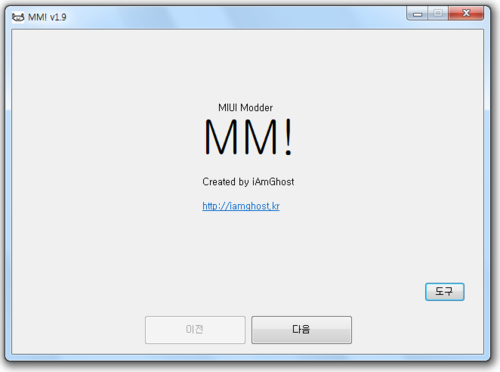

2011년쯤 Google Nexus One을 가지고 놀때 MIUI라는 커스텀 롬이 유행한적이 있습니다.
(Xiaomi사의 폰에 기본 탑재)

이 커스텀 롬이 중국 최적화다 보니 이런저런 빠진 기능이나 문제되는 부분들이 많아 시스템 파일 해킹을 통한 기능 개선들이 많았는데 적용하기가 상당히 번거로웠습니다.

그 때 당시 MIUI 시스템 어플리케이션들에 대한 소스코드 공개가 이루어지지 않아 apktool을 사용해 디컴파일 하고, Smali 코드를 고치는 정도가 한계였습니다.

그래서 이를 미리 적용해놓은 패키지들이 많이 나왔었는데 MIUI가 거의 1주일에 한번씩 롬이 나오다보니 이걸 만드는 분들도 많이 지치곤 했습니다.

때문에 자동화 툴을 만들면 괜찮지 않을까 하는 생각이 들어 이걸 만들게 되었습니다.

이런저런 커뮤니티에서 꽤 인기를 끌었기 때문에 나름 히트작이라고 자부하고 있습니다.

다운로드:
https://www.mediafire.com/folder/pq8u5q4yp63xp//MM

소스코드:
https://github.com/iAmGhost/MM-MIUI-Modder