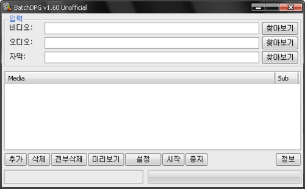

동영상 파일을 DPG(nDs-mPeG) 파일로 변환해주는 BatchDPG의 비공식 수정판입니다.

역사가 꽤 깊으나 귀차니즘을 핑계로 보존이 잘 안되었습니다.

위 페이지에서 모든 버전을 다운로드 할 수 있습니다. 가장 최신 버전은 1.61.

사용법은 아래 블로그에 꽤 자세하게 나와있습니다.

[http://blog.naver.com/pandacpy/30027759870](http://blog.naver.com/pandacpy/30027759870)

조잡한 스크립트 문법을 사용해 레터박스 넣기나 필터링 등 이것저것이 가능했습니다.

소스코드 및 다운로드:

[https://github.com/iAmGhost/BatchDPG_Unofficial](https://github.com/iAmGhost/BatchDPG_Unofficial)